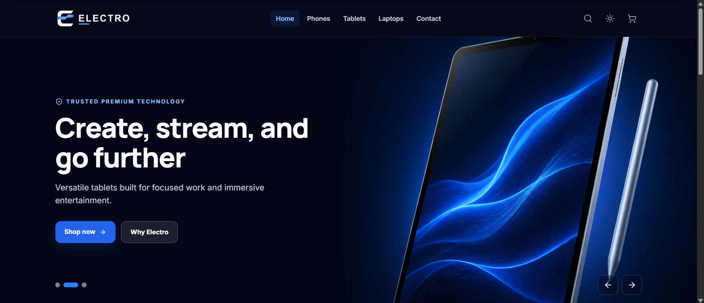
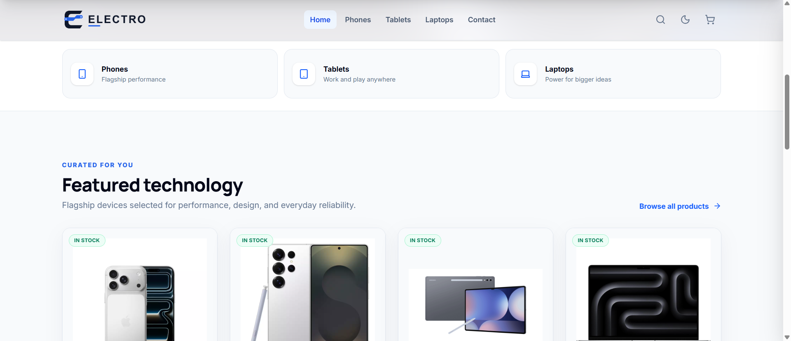
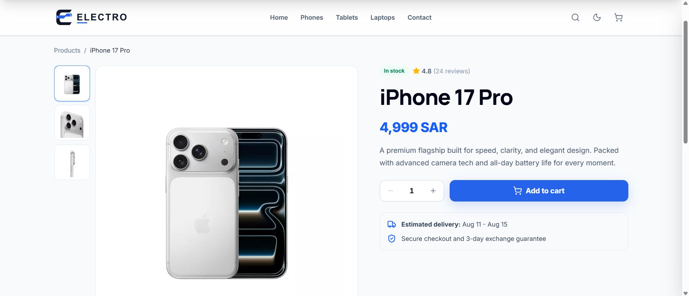
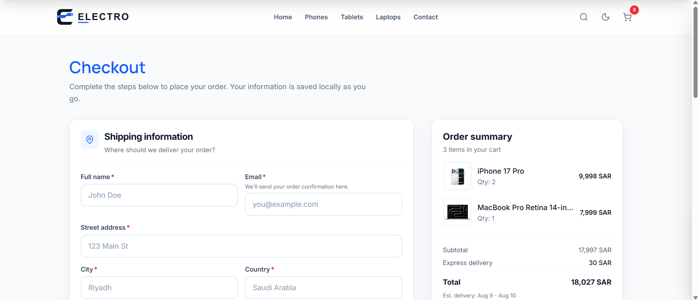

<div align="center">
  

  <p><strong>A responsive electronics storefront built for product discovery, cart management, and a polished demo checkout.</strong></p>

  <p>
    <a href="https://electro-one.vercel.app/"><strong>View live demo</strong></a>
    ·
    <a href="https://github.com/AHM2010/Electro">Repository</a>
  </p>

  <p>
    <a href="https://react.dev/"></a>
    <a href="https://vite.dev/"></a>
    <a href="https://tailwindcss.com/"></a>
    <a href="https://vercel.com/"></a>
  </p>
</div>



## Overview

Electro is a front-end e-commerce experience for browsing phones, tablets, and laptops. It combines a data-driven product catalog with responsive navigation, product search, detailed product pages, a persistent shopping cart, and a validated checkout flow.

The project is designed as a portfolio demonstration of a modern React storefront. Product information is stored locally, browser storage preserves cart and checkout drafts, and order submission is simulated—there is no backend, user account system, inventory service, or real payment processing.

## Highlights

- Responsive storefront with dedicated desktop and mobile navigation
- Light and dark themes with saved user preference
- Eleven locally defined products across three categories
- Search by product name or URL slug
- Persistent cart with quantity controls and calculated subtotals
- Product galleries, specifications, delivery estimates, and shipping details
- Validated, responsive demo checkout with standard and express delivery
- Accessible dialogs, form feedback, focus states, and semantic page structure

## Live Demo

Explore the deployed application at **[electro-one.vercel.app](https://electro-one.vercel.app/)**.

> [!NOTE]
> Electro is a demonstration storefront. Do not enter real payment information; checkout does not charge a card or send an order to a server.

## Screenshots

### Product discovery



### Shopping experience

| Product details | Cart management |
| --- | --- |
|  |  |

### Checkout



## Features

### Product discovery

- Automatic hero carousel with manual slide controls
- Featured-product section and complete catalog view
- Dedicated phone, tablet, and laptop category pages
- Search overlay with matching product results
- Product availability states with guarded cart actions
- Dynamic product routes based on readable slugs

### Product experience

- Multi-image product galleries
- SAR currency formatting
- Product descriptions and technical specifications
- Quantity selection with guarded minimum values
- Estimated delivery windows and shipping information
- Responsive product cards with direct cart actions

### Cart and checkout

- Slide-in cart drawer with add, remove, increment, and decrement actions
- Cart item count and subtotal calculations
- Cart persistence through `localStorage`
- Shipping, optional billing, delivery, and payment form sections
- Standard delivery with free shipping above 7,000 SAR and a 30 SAR express surcharge
- Inline validation, touched-field feedback, and card-number formatting
- Checkout draft persistence and an empty-cart state

### User experience

- Responsive layouts from mobile navigation through desktop checkout
- Light and dark themes that follow or override system preference
- Route-aware document titles and scroll restoration
- Animated page content with reduced-motion-aware CSS
- Contact form validation with a prefilled `mailto:` handoff
- Application-level error boundary and clear empty states

## Tech Stack

| Responsibility | Technology |
| --- | --- |
| UI | React 19, JSX |
| Routing | React Router DOM 7 |
| Styling | Tailwind CSS 4, custom CSS |
| State | React Context, custom hooks, component state |
| Persistence | Browser `localStorage` |
| Animation | AOS |
| Icons | Lucide React, Bootstrap Icons |
| Build tooling | Vite 8, PostCSS, Autoprefixer |
| Code quality | ESLint 10 |
| Deployment | Vercel SPA rewrites; static build preparation for Sites |

## Architecture

Electro is a client-rendered single-page application. `App.jsx` defines the route tree, while `Layout.jsx` supplies shared navigation, search, cart, main content, and footer UI. A single local dataset powers category listings, featured products, search results, and product-detail routes.

Global cart behavior lives in `CartContext`; checkout form state and validation are isolated in `useCheckoutForm`. UI-specific state—including theme, drawer visibility, search terms, carousel position, gallery selection, and product quantity—stays close to the component that owns it.

## Project Structure

```text
1.4-Electro/
├── public/                  # Favicons, web manifest, and social preview image
├── scripts/
│   └── prepare-sites-build.mjs
├── src/
│   ├── assets/             # Logos, hero artwork, products, and screenshots
│   ├── components/         # Shared storefront UI
│   │   └── checkout/       # Checkout form and summary components
│   ├── context/            # Cart context and provider
│   ├── data/               # Product catalog and navigation data
│   ├── hooks/              # Cart access and checkout form logic
│   ├── layouts/            # Shared application shell
│   ├── pages/              # Catalog, product, contact, and checkout pages
│   ├── utils/              # Formatting helpers
│   ├── App.jsx             # Routes and application-level behavior
│   ├── index.css           # Tailwind import and global styles
│   └── main.jsx            # React entry point
├── eslint.config.js
├── index.html
├── package.json
├── vercel.json             # SPA fallback rewrite
└── vite.config.js
```

## Getting Started

### Prerequisites

- Node.js 20.19+ or 22.12+
- npm

### Installation

1. Clone the repository:

   ```bash
   git clone https://github.com/AHM2010/Electro.git
   cd Electro
   ```

2. Install dependencies:

   ```bash
   npm install
   ```

3. Start the development server:

   ```bash
   npm run dev
   ```

4. Open the local URL printed by Vite, typically `http://localhost:5173`.

No environment variables are required.

### Production build

```bash
npm run build
npm run preview
```

## Available Scripts

| Command | Description |
| --- | --- |
| `npm run dev` | Start the Vite development server with hot module replacement |
| `npm run build` | Create the optimized production build and Sites worker entry point |
| `npm run preview` | Serve the production build locally for verification |
| `npm run lint` | Run ESLint across the project |

## Usage

1. Browse featured products or open a category from the main navigation.
2. Search for a device by name, or open a product to view its gallery and specifications.
3. Choose a quantity and add the product to the cart.
4. Adjust quantities in the cart drawer and continue to checkout.
5. Complete the validated demo form, choose a delivery method, and place the simulated order.

Cart contents, checkout drafts, and theme preference remain available after a refresh because they are stored in the browser.

## Routes

| Route | Purpose |
| --- | --- |
| `/` | Landing page with hero, featured products, and brand highlights |
| `/home` | Complete product catalog |
| `/phones` | Phone catalog |
| `/tablets` | Tablet catalog |
| `/laptops` | Laptop catalog |
| `/products/:slug` | Dynamic product details |
| `/checkout` | Cart review and demo checkout |
| `/contact` | Contact information and validated email handoff form |

## Performance and Quality

- Vite-powered production bundling and route-compatible deployment rewrites
- Lazy loading for noncritical product and gallery images
- Responsive hero artwork and adaptive product grids
- Memoized cart operations, totals, search results, and checkout sections
- Persistent cart and checkout drafts for refresh resilience
- Semantic landmarks, labels, fieldsets, legends, and live feedback regions
- Accessible names for icon-only controls and keyboard-visible focus treatments
- Dialog focus restoration, Escape-key handling, and guarded quantity controls
- Top-level React error boundary for unexpected rendering failures

## Current Limitations

- Catalog, prices, and availability are static local data
- Checkout is simulated and does not process payments
- No authentication, customer accounts, backend API, or database
- No automated test suite is currently configured
- Unknown routes do not yet have a dedicated not-found page

## Future Improvements

- Connect products, inventory, customers, and orders to a backend
- Integrate a real payment provider and server-side order validation
- Add filters, sorting, pagination, and richer search
- Add unit, integration, accessibility, and end-to-end tests
- Introduce authentication, saved addresses, and order history
- Add a dedicated not-found route and route-level error handling

## Contributing

Contributions and suggestions are welcome:

1. Fork the repository.
2. Create a focused feature branch.
3. Make and verify your changes with `npm run lint` and `npm run build`.
4. Open a pull request describing the problem and solution.

## Author

**Ahmed Ashraf**

- GitHub: [@AHM2010](https://github.com/AHM2010)
- Repository: [AHM2010/Electro](https://github.com/AHM2010/Electro)

## License

No license file is currently included. Unless a license is added, the source code remains under the author's default copyright.
